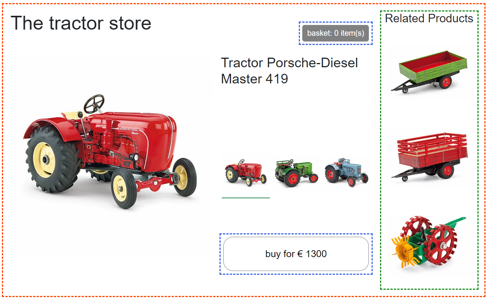

# Micro-frontends Blazor demo 

This demo is a proof of concept for a micro-frontends architecture using Blazor. ([live demo](https://micro-frontend-demo.roza.dev/)).

The original application is written in javascript and was the inspiration to create this demo.
It is made by [micro-frontends.org](https://micro-frontends.org/) and their application can be found [here](https://micro-frontends.org/0-model-store/).

Both applications allow you to select one of 3 tractors. Every tractor can be added to your basket via a buy button, and every tractor has 3 recommendations which depend on what tractor is being viewed.

## Goal

The goal of this demo is to demonstrate the separation of concerns by using a micro frontends architecture based on Microsoft's Blazor framework.
Using this architecture, teams can work independently on their own domain, without having to worry about other teams.

This demo is purely focused on the separation of concerns.

## Domains

This demo is split up into 3 domains. Every domain has their own team; Product, Related and Order. 

### Product
Render a product page, navigate products, render relevant components from other teams.

### Related
Render 3 products which are related to the selected product.

### Order
Render a basket and a button which adds the selected tractor to the basket.

# Architecture

The application is composed of 3 Blazor Component Libraries and a Blazor Server Hosted application.
The hierarchy is as follows:
```
┌───────────────┐
│    Product    │
├───────┬───────┤
│Related│ Order │
└───────┴───────┘
```

The `Product` domain (red) has the main component and it is responsible for rendering the product and the other components.  
The `Related` domain (green) is responsible for rendering the related products.  
The `Order` domain (blue) is responsible for rendering the buy button and the basket.

Communication within one domain is up to the team responsible. Communication between domains is done by using the Blazor Parameter feature. If any parameter changes, the components should react accordingly (e.g. update the price to reflect the right product.)

In this demo, the Product team communicates the TractorId of the selected tractor to the Related and Order team using their exposed TractorId parameters.

Communication between the buy button and the basket is done via a service within the Order domain. This is because the buy button and the basket are not in the same component tree, but in the same domain.


* Red: Product component
* Green: Related component
* Blue: Order component

# Running the application
To start the project, run the following command:
```bash
dotnet run --project Server
```
Or if you want to run it in docker, you can run this command:
```
docker build -t microfrontendsdemo -f Server/Dockerfile . && docker run -p 5068:80 --rm -it microfrontendsdemo
```
After that, the project can be accessed at http://localhost:5068

---
## More info

### Product project

The Product component library contains the "App.razor" component.
This component is responsible for rendering the product, product picker and
the other components (`Related` and `Order`).

This component also contains the logic to communicate with the other components.
It communicates the `TractorId` with the `Related` and Order `components` and it also
communicates the selected product with the `Order` and `Related` components.

### Related project

The `Related` component library contains the Recos component.
This component is responsible for rendering the related products.
This component expects a TractorId as parameter.
The TractorId is used to fetch the related products from the server
(in this demo it's hard coded, but in practice you'll want to fetch the data from an actual api).

### Order project

The `Order` component library contains the `Buy` and `Basket` component.
The `Buy` component is responsible for rendering the buy button.
This component expects a TractorId as parameter.
This TractorId is used to fetch the price of the product from the server (again, hardcoded in this demo).

Both the `Buy` and the `Basket` components have a BasketService service which is injected via Dependancy Injection.
The `Buy` service will add the product.
The `Basket` service will listen to the `OnChange` event and update the basket accordingly.

This comminucation is done via a service because the `Buy` and `Basket` components are not in the same component tree.
Attributes won't work in this case, because we do not want to delegate state management to the `Product` component.

### Server project

The `Server` project is just a shell application which renders the `App` component which
can be found in the `Product` component library.
